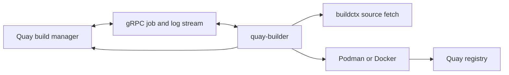

# quay-builder Architecture

## Purpose

Automated container build worker for Quay using Podman/Docker.



## High-Level Design

```
Quay (build trigger)
    ↓ gRPC
quay-builder
    ↓ Build execution
Podman/Docker
    ↓ Image push
Quay registry
```

## Components

### `/cmd/quay-builder`
Worker entrypoint:
- Connects to Quay via gRPC
- Polls for build jobs
- Reports build status

### `/buildctx`
Build context fetchers:
- **Git**: Clone from GitHub/GitLab/Bitbucket
- **Tarball**: Download and extract
- **Inline**: Dockerfile from request body

### `/buildpack`
Build execution:
- Dockerfile parsing
- Multi-stage build handling
- Build arg injection
- Layer caching

### `/containerclient`
Container runtime abstraction:
- Podman client
- Docker client
- Runtime auto-detection

### `/rpc`
gRPC client for Quay:
- Job polling
- Build log streaming
- Status updates
- Image push coordination

## Build Flow

```
1. Quay → quay-builder: BuildRequest{repo, dockerfile_url, context}
2. quay-builder → buildctx: Fetch context (git clone / tar download)
3. quay-builder → buildpack: Parse Dockerfile
4. buildpack → Podman: Execute build
5. Podman → buildpack: Stream logs
6. quay-builder → Quay: Stream build logs (gRPC)
7. Podman: Build complete, tag image
8. quay-builder → Quay registry: Push image
9. quay-builder → Quay: BuildComplete{image_id, digest}
```

## Build Context Handling

### Git Context
```
1. Clone repo to /tmp/build-<uuid>/
2. Checkout commit/branch/tag
3. Apply submodules (if .gitmodules exists)
4. Build from repo root (or dockerfile_path)
```

### Tarball Context
```
1. Download tarball
2. Extract to /tmp/build-<uuid>/
3. Build from extracted root
```

### Inline Context
```
1. Write Dockerfile to /tmp/build-<uuid>/Dockerfile
2. Build with no context (FROM only)
```

## Configuration

```yaml
worker:
  name: builder-01
  concurrency: 4

quay:
  endpoint: grpc://quay.example.com:50051
  token: ${QUAY_TOKEN}

runtime:
  type: podman  # or docker
  socket: unix:///var/run/podman/podman.sock

build:
  cache_dir: /var/cache/quay-builder
  max_context_size_mb: 2048
  timeout: 3600
```

## Performance

- Parallel builds (configurable concurrency)
- Layer caching (shared across builds)
- Build context caching (git repos)
- Cleanup after build (temp dirs, dangling images)

## Security

- Isolated build contexts (separate temp dirs)
- No arbitrary command execution
- Dockerfile validation before build
- Resource limits (CPU, memory, timeout)
